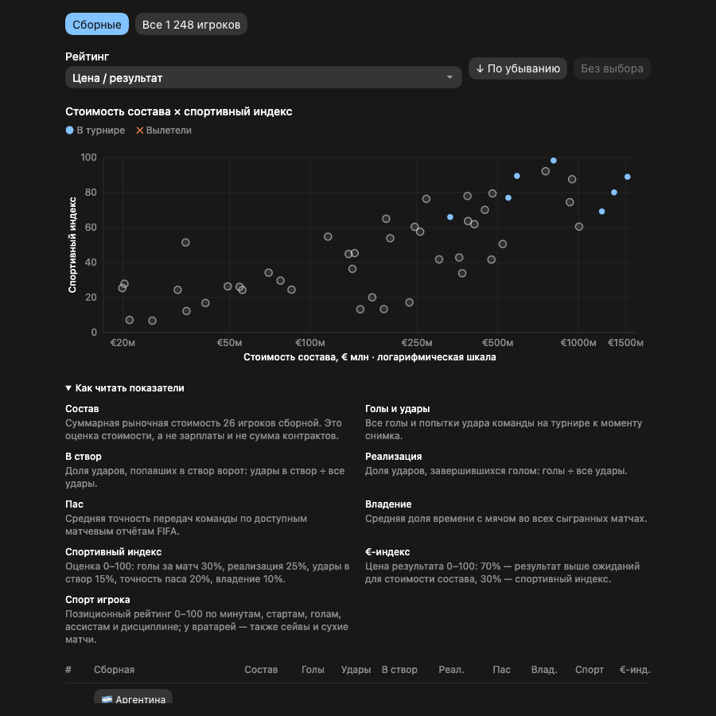

# World Cup 2026 Efficiency

Интерактивная таблица эффективности сборных и игроков чемпионата мира 2026.

В проекте отображаются:

- рыночная стоимость составов и игроков;
- голы, удары, точность ударов, реализация, передачи и владение;
- спортивный индекс сборных и игроков;
- индекс результата с поправкой на стоимость состава;
- текущая стадия команды или этап вылета.

## Запуск

Проект не требует сборки и внешних зависимостей. Откройте `index.html` в браузере.

## Публикация

Для GitHub Pages включите в настройках репозитория: `Settings → Pages → Deploy from a branch → main / root`.

Для Cloudflare Pages можно загрузить всю папку через `Workers & Pages → Create application → Drag and drop`.

## Данные

Снимок данных: 10 июля 2026 года, после матча Франция — Марокко и перед матчем Испания — Бельгия.

Стоимость состава — это рыночная оценка игроков, а не зарплаты и не сумма клубных контрактов. Источники, указанные в интерфейсе: Transfermarkt, FIFA World Cup 2026 Dataset и отчёты FIFA Training Centre.
